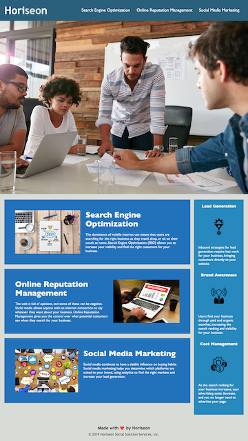

# Horiseon Project

**Description**

The Company, Horiseon, previous to the project had a full functioning website but wanted to implement additional features to increase accessibility allowing the site to be optimal for search engine optimization.

**Technologies**

1. HTML

I added semantic HTML tags and used logic to organize the consecutive flow of the page.

2. CSS

I reduced the amont of CSS styling that was original. By combining classes it allowed for cleaner code as well as improved page loading speed.

**Contribute**

If you would like to contribute to this project, you can do so by clicking [here](https://github.com/lacey-griffith/Horiseon-project)

**Result**

This project is complete to the current criteria of The Company. The final project can be viewed by clicking [here.](https://lacey-griffith.github.io/Horiseon-project/)
